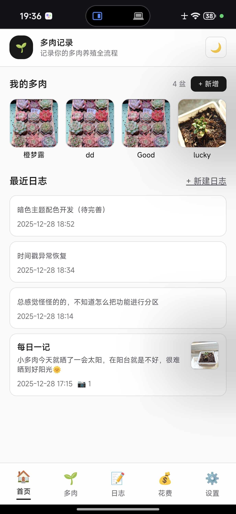
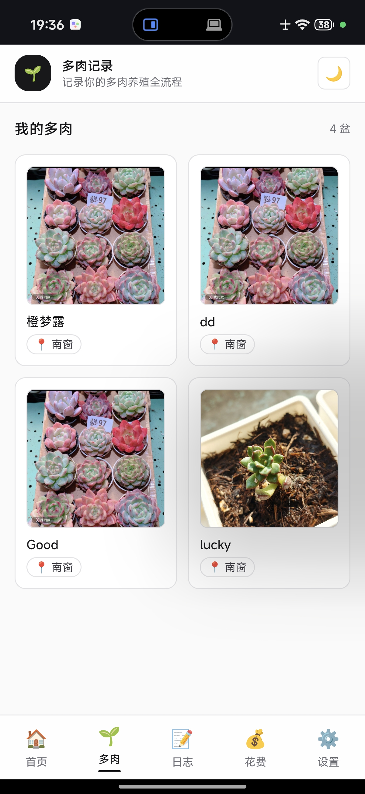
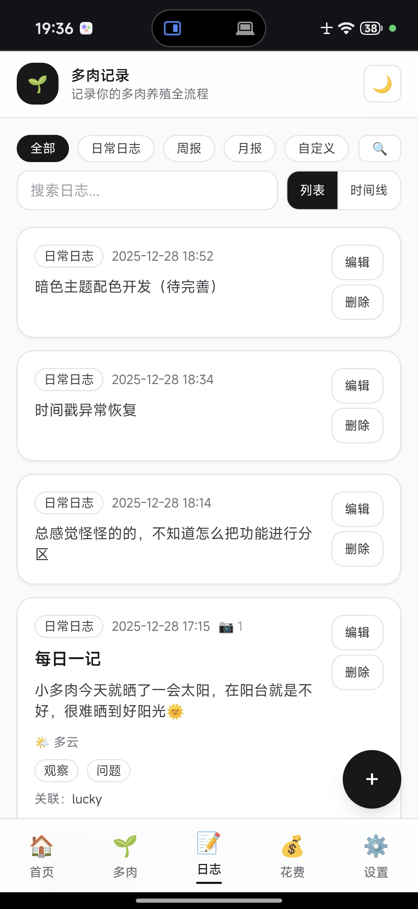
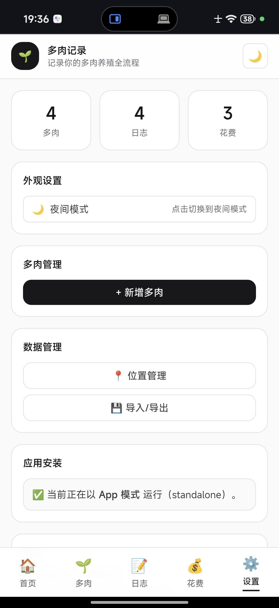
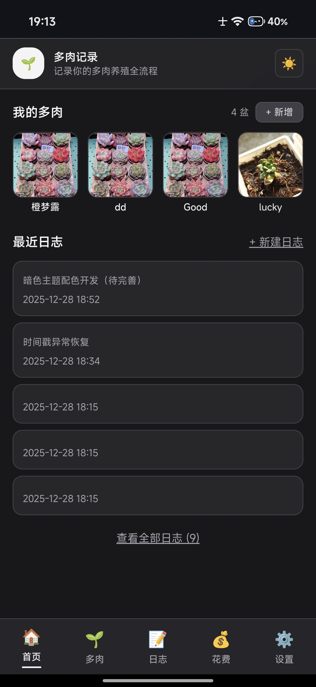
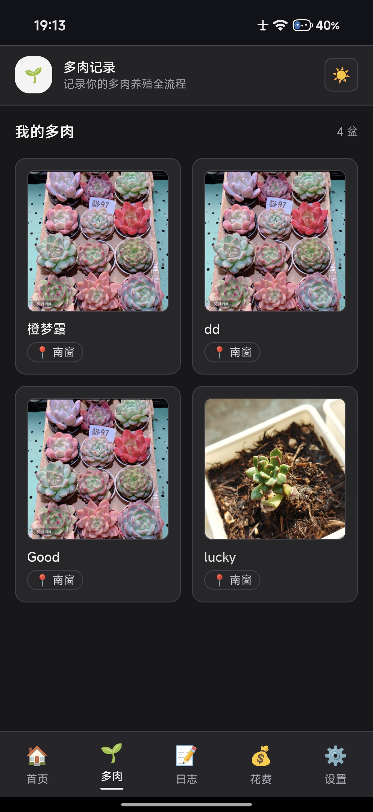
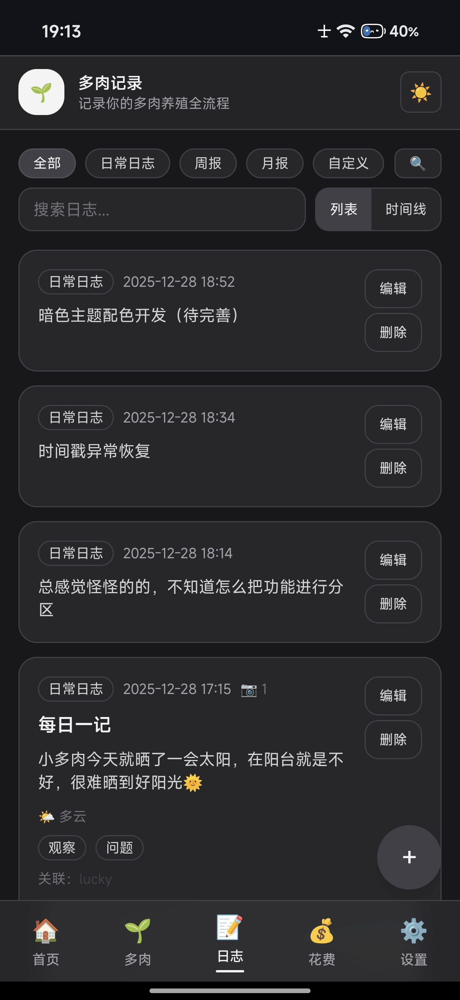
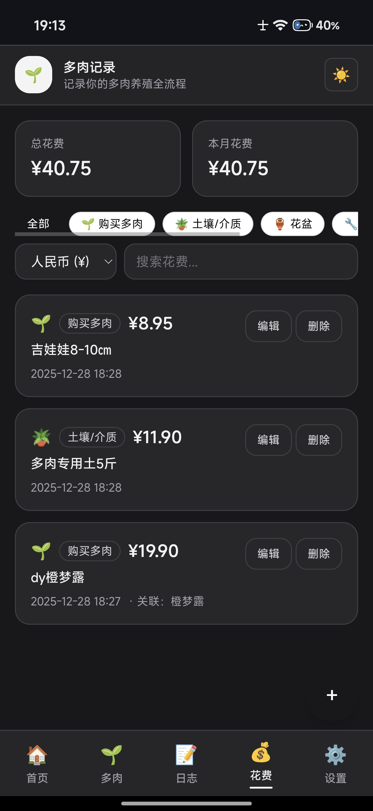
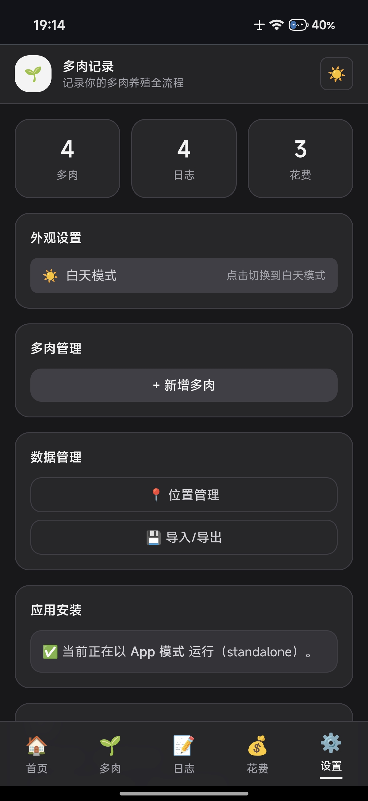

# 🌱 PlantByGPT · 多肉养殖记录相册

👉 **在线使用（Demo）**：https://plantrecordsplus.netlify.app/

PlantByGPT 是一个 **用来记录多肉养殖过程的网页应用**。  
你可以把它当成：  
👉 **多肉专用相册 + 养护日志 + 时间线回顾工具 + 花费管理**

不需要注册账号，不会上传你的照片，所有数据都保存在你自己的浏览器里。

## 📸 应用截图

### 🌞 亮色主题

<table>
<tr>
<td width="50%">
<strong>主页 - 多肉头像和最近日志</strong> 

</td>
<td width="50%">
<strong>多肉模块 - 多肉卡片列表</strong> 

</td>
</tr>
<tr>
<td width="50%">
<strong>日志模块 - 时间线视图</strong> 

</td>
<td width="50%">
<strong>花费模块 - 花费记录和统计</strong> 

</td>
</tr>
<tr>
<td colspan="2" align="center">
<strong>设置模块 - 数据管理和主题设置</strong> 

</td>
</tr>
</table>

### 🌙 暗色主题

<table>
<tr>
<td width="50%">
<strong>主页 - 多肉头像和最近日志</strong> 

</td>
<td width="50%">
<strong>多肉模块 - 多肉卡片列表</strong> 

</td>
</tr>
<tr>
<td width="50%">
<strong>日志模块 - 时间线视图</strong> 

</td>
<td width="50%">
<strong>花费模块 - 花费记录和统计</strong> 

</td>
</tr>
<tr>
<td colspan="2" align="center">
<strong>设置模块 - 数据管理和主题设置</strong> 

</td>
</tr>
</table>

---

## 🪴 这个应用可以做什么？

### 1️⃣ 记录你的多肉
- 为每一盆多肉创建独立记录
- 标注摆放位置（南窗 / 北窗 / 补光灯架等）
- 上传一张封面照片
- 自动显示「距离上次浇水多少天」
- 多肉卡片列表，方便浏览和管理

---

### 2️⃣ 记录养护事件（时间线）
你可以为每一盆多肉记录：
- 💧 浇水
- 🪴 换盆
- 🔄 移位
- 📸 状态快照 / 生长记录
- 📝 日志记录（关联总体日志）

每条事件支持：
- 添加照片
- 写备注
- 添加标签（如：土干透 / 盆轻 / 恢复中）

所有记录会按时间线展示，方便回顾。

---

### 3️⃣ 总体日志管理（新功能 ✨）
- 📝 创建总体日志（不特定于某盆多肉）
- 📅 支持日志类型：日常日志、周报、月报、自定义
- 🏷️ 标签分类和天气心情记录
- 📷 支持多张照片上传
- 🔗 可关联多盆多肉（自动在多肉详情页显示为事件）
- 📊 时间线视图和列表视图切换
- 🔍 高级筛选（按日期、标签、多肉、照片筛选）
- 📱 响应式卡片布局，优化移动端体验

---

### 4️⃣ 花费管理（新功能 ✨）
- 💰 记录各类花费（购买多肉、土壤、花盆、工具、肥料、其他）
- 💵 多货币支持（人民币、美元、欧元）
- 📊 总花费和本月花费统计
- 📷 支持上传收据和商品照片
- 🔗 可关联多肉，追踪单盆花费
- 🔍 花费搜索和筛选

---

### 5️⃣ 像相册一样保存照片（重点）
- 照片**不会上传到服务器**
- 照片保存在你浏览器本地（类似手机相册）
- **不会压缩、不会降低清晰度**
- 适合长期保存多肉生长变化
- 📱 响应式照片网格布局（1张、2张、3+张自动适配）

---

### 6️⃣ 暗色主题（新功能 ✨）
- 🌙 支持白天/夜间模式切换
- 🎨 统一的暗色主题配色
- 💾 自动保存主题偏好
- 📱 所有页面和组件完整适配暗色模式

---

## 📦 备份与恢复（强烈推荐）

### ✅ ZIP 备份（最重要）
你可以一键导出一个 ZIP 文件，里面包含：
- 所有多肉与事件记录
- 所有日志记录
- 所有花费记录
- **所有照片的原始文件（可直接打开）**

这个 ZIP 文件可以：
- 保存到电脑 / 网盘
- 换浏览器或换设备后导入恢复
- 作为你的"多肉相册存档"

👉 建议：**定期导出 ZIP 备份**

### 📍 位置管理
- 统一管理多肉的摆放位置
- 支持自定义位置名称
- 方便批量查看和管理

---

### ⚠️ 关于数据安全（一定要看）
- 所有数据默认只存在于你的浏览器中
- 清理浏览器数据 / 使用无痕模式 / 更换设备  
  👉 **都会导致数据消失**
- ZIP 备份是目前唯一可靠的长期保存方式

---

## 🔁 分享给朋友是怎么用的？

- 你可以直接把网页链接发给朋友  
  👉 他们会看到一个“全新的空白应用”（这是正常的）
- 如果你想分享**你的记录和照片**：
  1. 在应用中导出 ZIP 备份
  2. 把 ZIP 文件发给朋友
  3. 朋友在网页中选择「从 ZIP 导入」

---

## 🧠 适合谁使用？

- 🌵 有多盆多肉，想系统记录养护过程
- 📸 希望用照片长期记录状态变化
- 🔒 在意隐私，不想把照片传到云端
- 📝 想做阶段性回顾与总结
- 💰 想记录多肉相关的花费
- 📊 需要统计和分析养护数据

---

## ✨ 最新版本特性（v2.1.0）

- ✅ 日志管理模块：总体日志、时间线视图、高级筛选
- ✅ 花费管理模块：花费记录、多货币支持、统计功能
- ✅ 暗色主题：完整的白天/夜间模式支持
- ✅ 界面重构：主页重新设计、多肉模块独立页面、设置模块整合
- ✅ 日志与多肉双向联动：关联多肉自动显示为事件
- ✅ 移动端优化：响应式设计、卡片布局优化

---

## ❌ 当前版本不支持
- 云端同步
- 多设备自动同步
- 多人协作
- 公共在线相册分享

（但可以通过 ZIP 备份手动实现迁移和分享）

---

## 🌱 一句话总结
**PlantByGPT 是一个"属于你自己的多肉相册"，  
数据在你手里，照片不失真，随时可以打包带走。  
现在更强大：日志管理、花费统计、暗色主题，一应俱全！**
